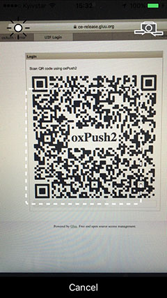
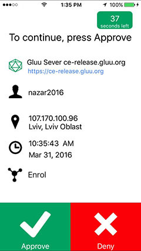
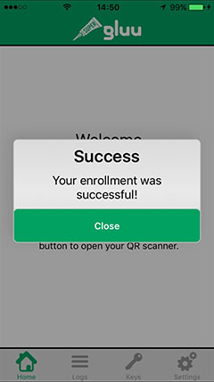
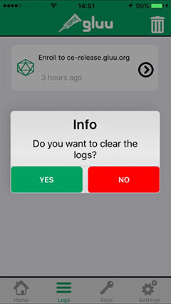
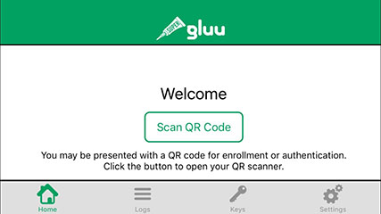
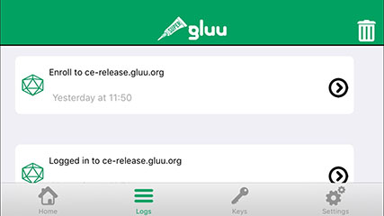
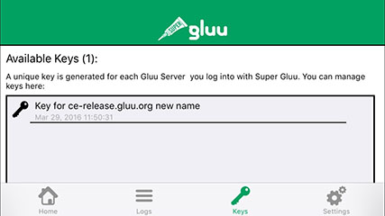
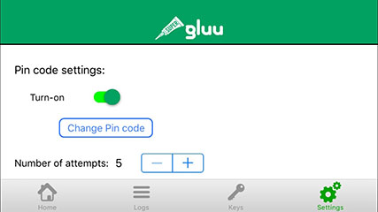
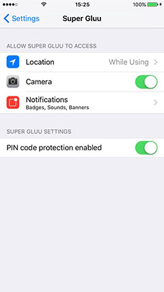

# Super Gluu User Guide
## Splash Screen

## Confirm Push Notification

The first time Super Gluu launches, it will ask for permission to send push notifications from the Gluu Server. This choice can be changed later in your device settings. More information about the push notification will be covered later in the document.

## License Agreement

Accept the license to use the application. Scroll down to read the full Super Gluu EULA. Once accepted, it will not display the EULA again.

## PIN Protection

For additional security, configure a PIN to access Super Gluu. The PIN can be changed in the application settings later.

## Application Tabs

After configuration, the main screen is displayed. It features a welcome message and the `Scan QR Code` button, as well as tabs at the bottom, as follows:

- **Home:** displays the main screen
- **Logs:** shows all logs during enrollment/authentication
- **Keys:** contains all available keys saved on device, unique files the app uses to authenticate the device on the server side
- **Settings:** reconfigure settings after initial setup

### Home

#### QR Code Enrollment

To enroll a device, enter the credentials in your Gluu Server web app to generate a QR code, after that, click the `Scan QR Code` button on the Super Gluu app's Home screen:

If the scanning process is completed and the server returns the request correctly, it will prompt to `Approve` or `Deny`. To continue the enrollment/authentication process, click `Approve`:

The timer on the top right of the screen shows the time limit to choose to `Approve` or `Deny`. The color will change: yellow if it's under 20 seconds, red if it's under 10.

Next, it will redirect to the main page and display whether it was successful or not.

### Logs

Each time it enrolls or authenticates a device, the app will save corresponding logs in the Logs tab. They are color coded, green for successes and red for failures.

Clear these logs if necessary by tapping the `Clear` button.

 
 

The Log tab will report about the enrollment and authentication process and displays who logged in, when, and from where. Click on the arrow button to see additional information.  

The information screen contains data about:

- Gluu server name & server URL
- Username
- IP address & location
- Time & date

### Keys

This tab contains all available keys for each Gluu server. A key is a unique file that is generated during enrollment, and is used to authenticate the device on the server. If a key for a server is deleted, enroll again with a new key.

   

Change a key's name by pressing it for 3 seconds. It will prompt: `Do you want to change key's name?`

Delete a key in two ways:

1) Swipe left on the key, a delete button will appear on right side of the key

2) Tap on the key, a new information screen will appear. The `Delete` button is on the top right

### Settings

In the Settings tab, there are options to set up a new PIN, disable PIN protection, and change the number of failed attempts before being locked out for ten minutes. Choose any limit between 5 and 10 attempts.

There are options for either a simple 4-digit PIN or custom setup.

## Push Notifications

Super Gluu can receive push notifications from Gluu servers. The server can send an enrollment or authentication request to the application, as if it scanned the QR code directly. 

After choosing to receive push notifications either during initial setup or through the Settings tab later, enroll through the server. Super Gluu will send a token to the server, which will be used to send push notifications to the device.

After receiving the notification, tap `Approve` or `Deny` directly from the push menu. There are three options:

1) **If the device in locked:** Swipe left on the push notification, choose `Approve` or `Deny`

2) **If the device isn't locked:** Swipe down on the push notification, choose `Approve` or `Deny`

3) **If you click on the push notification:** The app launches, choose `Approve` or `Deny`

Super Gluu can receive a notification when the application is running in the foreground. It will pop down from the top of the screen.  Make a decision directly on this menu.

## Landscape Mode, Settings, iPad Support

Super Gluu can work in landscape mode, just rotate the device. Some components are hidden in landscape mode, scroll up and down to see them.

 
 
 

In the device settings are a few settings for Super Gluu - push notifications, location, access to camera, and PIN protection. Any change made in the device settings will take effect in the application.

Super Gluu can run on iPads, and the layout is the same for all IOS devices.

For more information please see the [Gluu Website](http://gluu.org)
