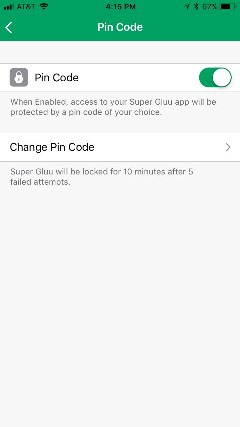
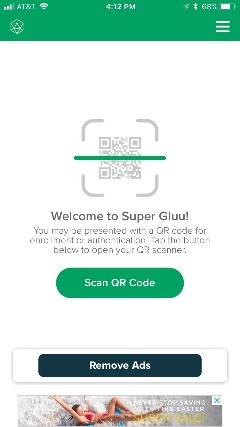
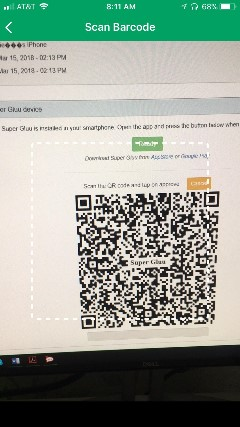
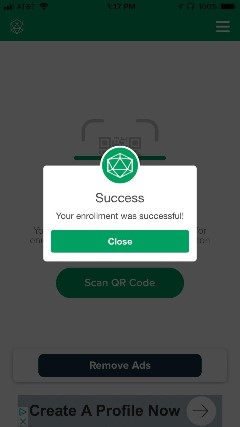
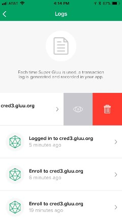

# Super Gluu User Guide

## Overview
This guide will show how to use the Super Gluu two-factor authentication mobile application. It covers initial set-up, managing keys and logs, and general settings.

## Initial Setup

### Camera Access Prompt
After installation, Super Gluu will request access to use your camera. The only time that the camera will be used is to scan a QR code to set up your two-factor authentication.

### Choose Login Method

For additional security, Super Gluu gives you the option to configure either a PIN or TouchID to access Super Gluu. This choice can be changed in the application settings later.

### Confirm Push Notification

Next, it will ask for permission to send push notifications from the Gluu Server. This choice can be changed later in your device settings. More information about the push notification will be covered later in the document.

## Main Screen

After configuration, the main screen is displayed. It features the main enrollment button in the center and the menu button in the top right.

### QR Code Enrollment

To enroll a device, enter the credentials in your Gluu Server web app to generate a QR code, then click the `Scan QR Code` button on the Super Gluu app's Home screen:

If the scanning process is completed and the server returns the request correctly, it will prompt to `Approve` or `Deny`. To continue the enrollment/authentication process, click `Approve`:

The timer on the top right of the screen shows the time limit to choose to `Approve` or `Deny`. The number color will change: yellow if it's under 20 seconds, red if it's under 10.

Next, it will redirect to the main page and display whether it was successful or not.

## Menu

After pressing the menu button, you'll get the option to view logs, keys, settings, and help files.

### Logs

Each time it enrolls or authenticates a device, the app will save corresponding logs in the Logs tab. The log details whether authentication was successful, with more details available if the log is tapped on.

Clear these logs if necessary by swiping left on the log, then tapping the red button.

The Log tab will report about the enrollment and authentication process and displays who logged in, when, and from where. Just tap on the log to get to the information screen. 

The information screen contains data about:

- Gluu server name & server URL
- Username
- IP address & location
- Time & date

### Keys

This tab contains all available keys for each Gluu server. A key is a unique file that is generated during enrollment, and is used to authenticate the device on the server. If a key for a server is deleted, enroll again with a new key.

Change a key's name, swipe left on it and tap the green button. To delete a key, swipe left on the key, then tap the red button.

### Settings

In the Settings tab, there are options to configure the PIN or TouchID.

## Push Notifications

Super Gluu can receive push notifications from Gluu servers. The server can send an enrollment or authentication request to the application, as if it scanned the QR code directly. 

After choosing to receive push notifications either during initial setup or through the Settings tab later, enroll through the server. Super Gluu will send a token to the server, which will be used to send push notifications to the device.

After receiving the notification, tap `Approve` or `Deny` directly from the push menu.

Super Gluu can receive a notification when the application is running in the foreground. It will look just like the original authentication screen

## Device Settings, iPad Support

In the device settings are a few settings for Super Gluu - push notifications, location, access to camera, and PIN protection. Any change made in the device settings will take effect in the application.

Super Gluu can run on iPads, and the layout is the same for all IOS devices.

For more information, please see the [Gluu Website](http://gluu.org)
